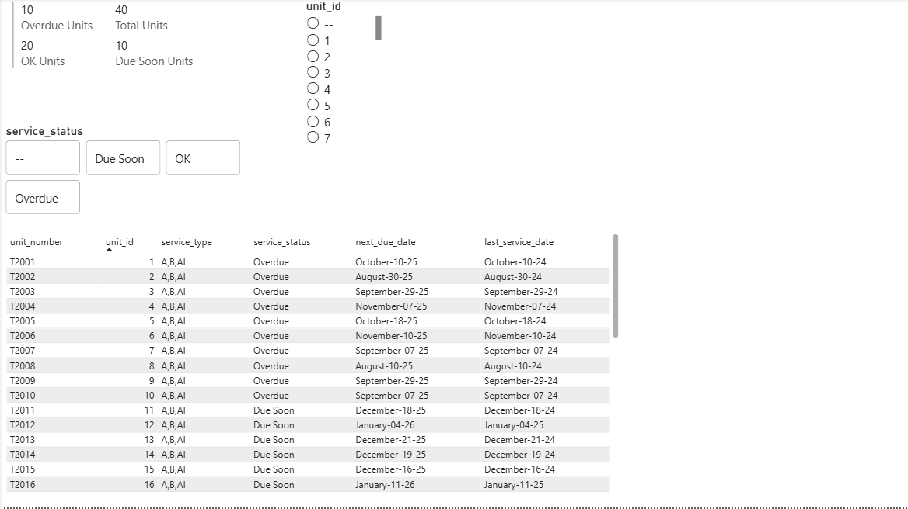
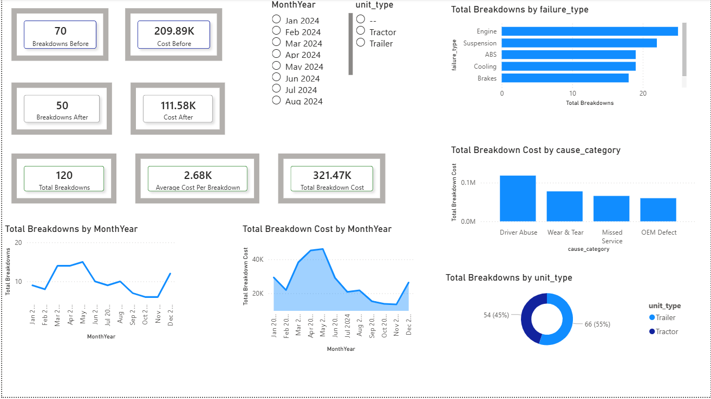

# Fleet Maintenance Analytics & Service Dashboard

This project is an end-to-end Fleet Maintenance Analytics System built using **Python**, **MySQL**, **SQL**, and **Power BI**.  
It provides insights into fleet health by analyzing service reminders, predictive service due dates, and historical breakdown events.

The project simulates real-world fleet operations and demonstrates how to reduce breakdowns, optimize service schedules, and manage maintenance costs.

### 🔹 Service Reminders Dashboard  

### 🔹 Breakdown Analysis Dashboard  

---

## Project Overview

This project contains four major components:

### 1. Python ETL Pipeline
- Loads raw CSV/XLSX files.
- Cleans and prepares datasets.
- Uploads all data into MySQL database tables.
- Ensures consistent schema across the Fleet Management System.

### 2. MySQL Database
Stores four main tables:

- `units_medium_improved`
- `service_reminders_clean`
- `predicted_service_due_clean`
- `breakdown_events`

SQL transformations create:
- Service priority ranking
- Overdue & due soon detection
- Breakdown summaries
- Cost and downtime analytics

### 3. Analytical SQL Queries
Includes all analysis used in the project:
- Overdue services  
- Due soon services  
- OK service summary  
- Breakdown cost by year  
- Preventable vs non-preventable breakdowns  
- Breakdown cost before/after a date  
- Breakdown by unit type  
- Breakdown distribution by failure type  
- Breakdown cause category analysis  

### 4. Power BI Dashboards
Two dashboards:
- **Service Reminders Dashboard**
- **Breakdown Analysis Dashboard**

These dashboards visualize the MySQL analytical layer.

---
